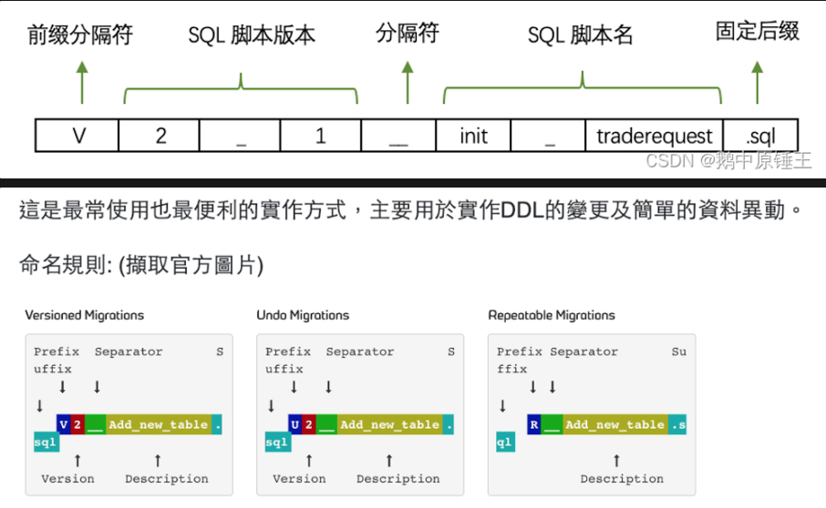

# 遷移的類型

- Versioned Migrations（版本遷移）:** 用於創建、更新、刪除：表、索引、外鍵。
- Undo Migrations（撤銷遷移）:** 即為Versioned Migratios的回滾機制。
- Repeatable Migrations（重複遷移）:** 用於建立views/procedures/functions/packages/…以及批次寫入特定數據。

- 